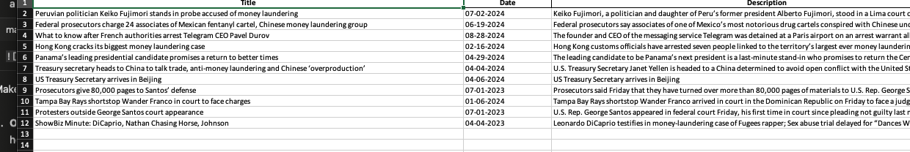
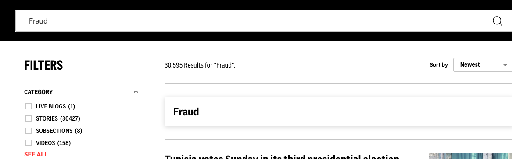

# Thoughtful AI Scraper for AP News Integrated with Robocorp

## Description
This project is a Python Selenium-based scraper designed to gather news data from the AP News website. The scraper is integrated into the Robocorp environment for seamless deployment and execution. Instructions for each step will be provided by the developer. The final output is saved into an Excel file with autofit functionality.

## Requirements
1. **Python Version**: 3.10 or higher.
2. **Robocorp Account Setup**: Ensure you have an active Robocorp account.
3. **Robocorp Knowledge**: Familiarity with running tasks in Robocorp and setting up Work Items.
4. **Robocorp Organization**: Access to the organization created by the developer.
5. **Dependencies**:
    - Managed using `conda.yaml` for the Robocorp environment.
    - A `requirements.txt` file is available for local testing.

## Testing the Script

There are two ways to test the script. This guide focuses on testing using a Python virtual environment.

### Step 1: Install `virtualenv` (if not already installed)
Run the following command to install the `virtualenv` package:
```bash
pip install virtualenv
```

### Step 2: Activate the Virtual Environment
Once you are in the root folder of the project, activate the virtual environment.

```bash
# For Mac
source venv/bin/activate
```
```bash
# For Windows
venv\scripts\activate
```

### Step 3: Set the Environment Variable for the Work Item
Before running the script, set the required environment variable to point to the Work Item input path:
```bash
#For Mac
export RC_WORKITEM_INPUT_PATH={path_to_project_root}/output/work-items-in/workitems.json
```

### Step 4: Install the Project Dependencies
Once the virtual environment is activated, install the necessary dependencies by running:
```bash
pip install -r requirements.txt
```

## Deployment to Robocorp
Details for setting up the Robocorp environment and deploying the scraper is provided by Robocorp documentation.


## Sample output file
```bash
  'apnews_data.xlsx'
```
Please see image:


This is a sample output using following Workitem data inputs:
```bash
  work_items.json
```

```bash
[{"payload": {
  "search_phrase": "Laundering", "category_name":"Videos"
  }, 
  "files": {}}]
```

## Input Guide
1. Describing the input **search_phrase** which is anything that you want to search from the search bar for query.

2. For filtering of news, customize it with **category_name**.
- Note: **category_name** has a guide, you cannot put anything to it. 
- Pick any of the following: (**Live Blogs**, **Stories**, **Subsections**, **Videos**)
- See APNews Website: https://apnews.com/
- Sample query: **Fraud**

